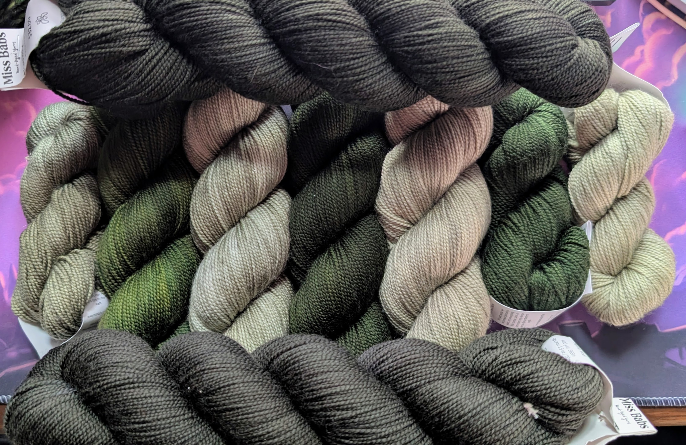
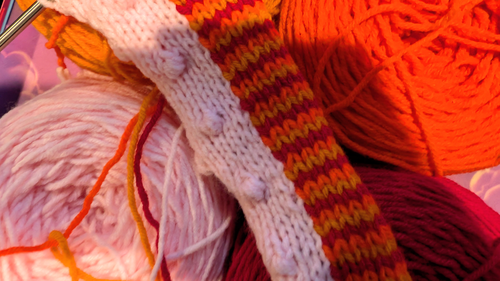
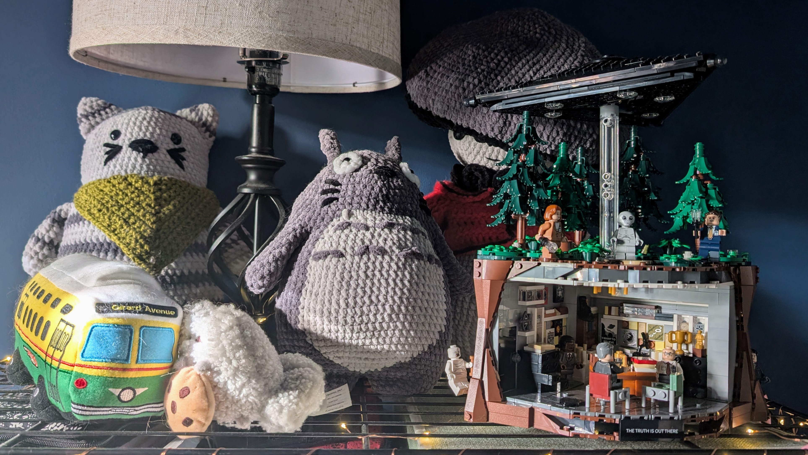
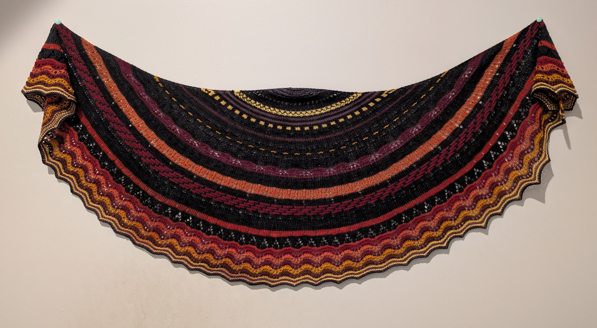

I have been knitting for over 20 years.

I learned from the Internet, slightly after YouTube was created but before it really took off, from the low-res videos on a particularly periwinkle knitting help website. I also read blogs: so many blogs. The Internet was awash in knitting blogs back then, and they were some of the most widely-read blogs out there. Seriously. It was **A Whole Thing**.

One of the habits I picked up from these blogs was **Always Buy An Extra Skein of Yarn**. This prevented the woe one would experience when they came up short for a project and couldn't get to the store; or worse yet, could, but found the store was sold out or only had yarn from a visibly different dye lot. (This was, as you could imagine, before most yarn stores were selling online.) And when you are just starting out, with 6 balls of yarn to your name, this is an amazing idea.

Eventually, however, this became **An Issue**.

This became an issue because often I would not use those extra skeins, leaving me with too little yarn to really make anything other than hats, which I did not really wear (and it would be several years before I met my husband, who does wear knit hats). This became an issue, because like most new knitters, I found the projects I were drawn to were not the projects I wore. This became an issue, because I am a dedicated frogger of those unworn projects, meaning while I also bought yarn for _new_ projects, plenty of my _old_ projects stopped being projects and became balls of yarn again. Oops. I also inherited my mother-in-law's yarn stash, which certainly embiggened my own.

That said, it's also easy enough to not realize how much yarn you have. This might seem preposterous given that I have literally hundreds of balls of yarn, but until I moved into my current house, most of my yarn lived in boxes and bags that were _around_ and I did not know what I had, so I would find a new project and look through some of the stash, but forget the other bits of it existed, and then just buy new yarn if I didn't have enough of what I wanted or the yarn I could see just wasn't right. Also, balls of yarn are _small_, especially if you compress them into plastic ziplock bags to keep the moths out.

But then I moved. I put all my yarn into one place. I also I stashed it [on Ravelry](https://www.ravelry.com/people/Acanthae). And that was when I realized I might have a not-so-small problem.

And so, last January, I stopped buying yarn. The more whimsical of you might say I **began my stashbusting journey**, but mostly I would argue that I finally just new what I had and it became easier to use it.

Since then, I have used _almost_ 100 individual skeins of yarn. Most of it was bulky-weight or thicker, meaning I cleared out over three bags in what felt like record time. I also got to use yarn I had mostly fallen out of love with because I bought it when I was eighteen and tried projects I would have never made before. Seriously, who knew fluffy amigurumi yarn critters would be so cute? Mushroom Guys? Fuzzy cat hats? Giant cotton cardigans I wear constantly even though it's _pink_ and _striped_? Sign me up. Not forever -- I've crawled back to fingering- and lace-weight shawls lately for the technical challenge after months of bulky fluff. But after 20 years, it's been interesting to discover there is still plenty of things to try -- or try _again_ after a decade or so.

That said, if I maintain my current trajectory, I still have about 9 years before I run out of yarn. Wish me luck?

**Patterns and projects shown/referenced in this post:**
- [Squidpocalypse](https://www.ravelry.com/projects/Acanthae/squidpocalypse) ([Pattern](https://www.ravelry.com/patterns/library/squidpocalypse))
- [Ink Cap Mushroom Guy](https://www.ravelry.com/projects/Acanthae/mushroom-guy) ([Pattern](https://www.ravelry.com/patterns/library/mushroom-guy-2))
- [Not-So-Long Cat](https://www.ravelry.com/projects/Acanthae/not-so-long-cat) ([Pattern](https://www.etsy.com/listing/1497149738/big-long-cat-crochet-pattern-create-you))
- [Striped Dockside](https://www.ravelry.com/projects/Acanthae/dockside) ([Pattern](https://www.ravelry.com/patterns/library/dockside-4))
- [Tabby Road](https://www.ravelry.com/projects/Acanthae/tabby-road) ([Pattern](https://www.ravelry.com/patterns/library/tabby-road))