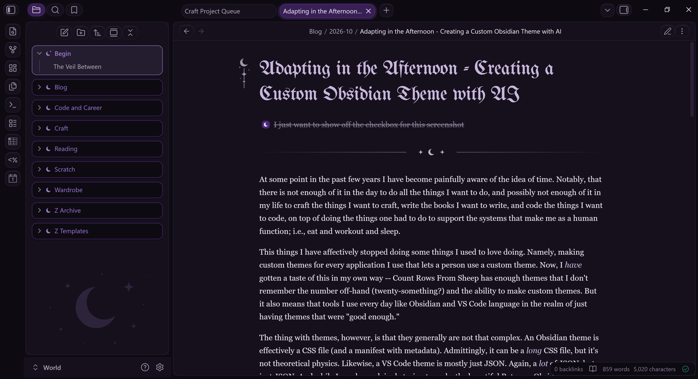
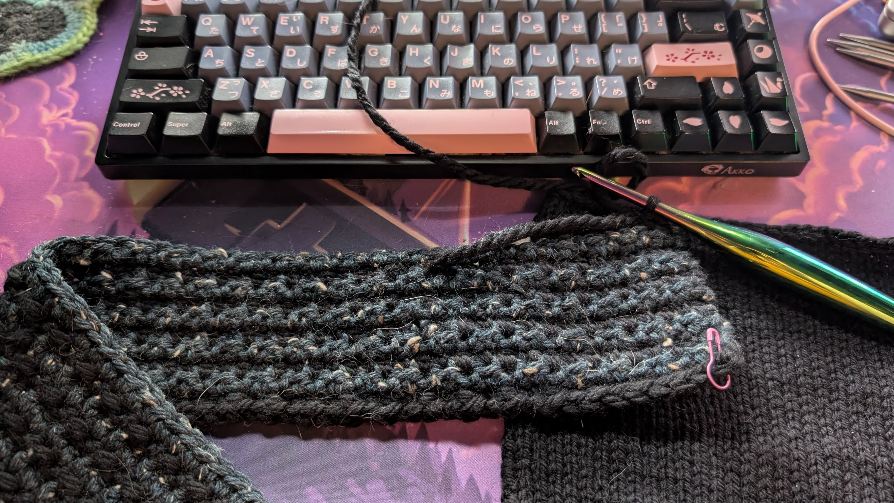
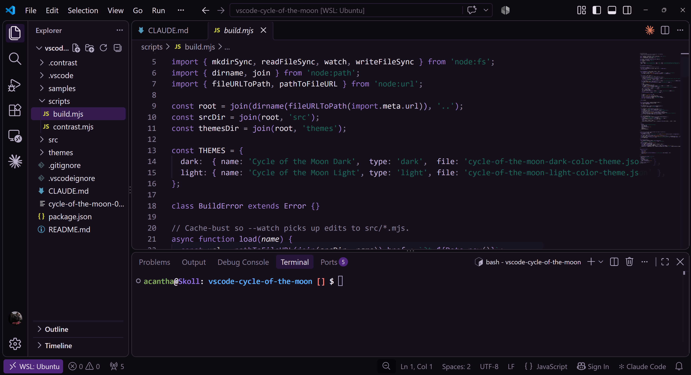

At some point in the past few years I have become painfully aware of the idea of time. Notably, that there is not enough of it in the day to do all the things I want to do, and possibly not enough of it in my life to craft the things I want to craft, write the books I want to write, and code the things I want to code, on top of doing the things one has to do to support the systems that make me as a human function; i.e., eat and workout and sleep.

Thus I have effectively stopped doing some things I used to love doing. Namely, making custom themes for every application I use that allows custom themes. Now, I _have_ gotten a taste of this in my own way -- [Count Rows From Sheep](http://countrowsfromsheep.com/) has enough themes that I don't remember the number off-hand (twenty-something?) and the ability to make custom themes. But this awareness of time also means that tools I use every day, like Obsidian and VS Code, languish in the realm of just having themes that are "good enough."

The thing with themes, however, is that they generally are not that complex. An Obsidian theme is effectively a CSS file (and a manifest with metadata). Admittedly, it can be a _long_ CSS file, but it's a CSS file all the same. Likewise, a VS Code theme is mostly just JSON. Again, a _lot_ of JSON, but just JSON. And while I was begrudgingly trying to make the beautiful Retroma Obsidian theme _just dark enough_ to please me (and failing), I had a bit of a realization:

> Is this not what AI is good for? Templating things that keep to standard structures and follow basic rules?

And so I went out to see if I could create a fully custom Obsidian theme in Claude in an afternoon while finishing up the last details of my [Everest Shawl](https://www.ravelry.com/projects/Acanthae/everest-shawl).

I began with what I, personally, would call "the fun part." I came up with colors and rules. I knew I wanted a dark, witchy theme with little moon details and soft, rounded elements. I then picked some colors I liked and mapped them to places I thought they would work in the theme.

Next, I asked Claude (the chat) to write up a `CLAUDE.md` file to give Claude (the code):

```
I want to use Claude Code to create my own theme for Obsidian. I want it to be fairly minimal with round the UI elements, with the following dark, witchy colors:

Background primary:   #0D0A12
Background secondary: #15101C
Background elevated:  #1D1628
Borders/dividers:     #2A2136

Text normal:          #E7E0EA
Text muted:           #B0A5B8
Text faint:           #8B8198

Primary accent:       #4E267B
Accent hover:         #69389D
Links:                #B596DA

Success/botanical:    #1D6A5C
Info/cool accent:     #285A8F
Danger/dramatic:      #7A2948
Warm accent:          #9A5B1A

Rare moon accent:     #CFC6D8
Moonmetal detail:     #B9B0C7

The vibe should be:

- moonlit crypt
- witch’s study
- gothic
- botanical
- quiet jewel tones
- minimal
  
Create a file I can provide to Claude Code to begin developing this theme.
```

Which it did, after attempting to tell me my color choices did not have enough contrast to be accessible -- which, fair, but I'm making this theme for _me_, Claude, and my eyes can handle it. The resulting file, of course, was 300 lines of text, because Claude is a wordy boy who likes to talk to himself. Core to this was breaking up the design work into 8 phases, and having me verify and tweak theming elements at those points:

```
1. **Setup** — repo layout, `manifest.json`, build/watch script, test vault, symlink instructions in README.
2. **Tokens + variables** — palette block and full Obsidian variable mapping. Stop and let the owner review in Obsidian before continuing.
3. **Shape** — radius scale, floating panes, tabs, ribbon, sidebar rows, buttons, inputs, modals, focus rings.
4. **Markdown** — everything in section 5.
5. **Enchantments** — moon divider, sidebar moon, title ornament, folder colors.
6. **Style Settings** — settings block and wiring.
7. **Plugin pass** — go through each plugin in section 8 using the test vault.
8. **Polish** — mobile check, performance check, README with install and dev-loop instructions.
```

(Claude, as you may notice, also felt very influenced by my instructions with _Enchantments_ being the title of phase 5.)

That said, this worked surprisingly well, and most sections only needed me to run manual checks and give the okay. The biggest issue I encountered was with section 5, where we had some problems getting the folder card shaping correct, something that was remedied by me digging into the CSS of existing themes I liked and providing some general guidance.



Overall, I ended up with my perfect Obsidian theme in only a couple of hours, much of which I spent crocheting while Claude worked the CSS. It even came up with some little details I wasn't expecting. Look at those little moons in the checkboxs! So cute.



And, emboldened by this turn of events, I _kept going_ and ended up asking Claude (the code) to write itself another `CLAUDE.md` file for a different instance of itself to make a VS Code theme, which took even less time and almost no intervention from me, since you can only change color elements of VS Code and not the UI shaping.



I won't lie and say I don't miss the long afternoons in high school and college perfecting the CSS I needed to get my Tumblr theme _just so_ or fighting Adobe Photoshop to mock up the perfect look for Winamp. But I'm also glad I don't have to choose between being genuinely happy with the appearance of my everyday tools and feeling like I am actually being productive. Sometimes, you can have both.